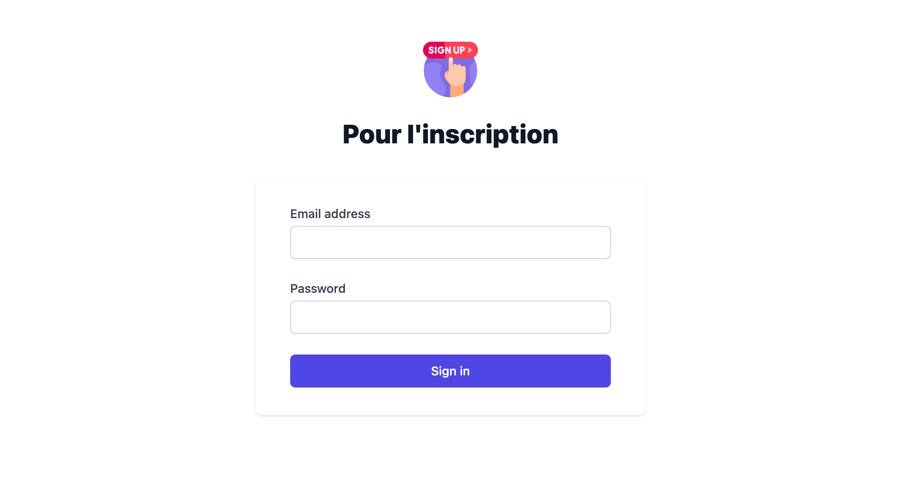

# HTML - EXPRESS

## 🎯 But du repo

Comprendre le passage d'une information du front vers le back

⚠️ Nous allons pas hacher le MDP ou faire un truc très complexe, le but est de comprendre comment l'ensemble front et back est lié

## Frontend

Nous allons avoir un frontend simple avec un formulaire de contact basique




## Backend

Concernant le backend, nous allons utiliser [expressjs](https://expressjs.com/fr/)

Nous allons aussi utiliser les dépendances :
 - [dotenv](https://www.npmjs.com/package/dotenv)
 - [mysql2](https://www.npmjs.com/package/mysql2)
 - [cors](https://www.npmjs.com/package/cors)

Et en dépendance de dev :
- [nodemon](https://www.npmjs.com/package/nodemon)

Nous avons aussi un fichier `database.sql` qui possède déjà des datas si vous souhaitez faire des tests.

## Installation

```shell
$ git clone git@github.com:GorskiAnthony/WCS_html_express.git
$ cd WCS_html_express/back
$ npm install
```

Pour faire la migration :

```shell
$ mysql -u <user> -p
Enter password:
Welcome to the MySQL monitor.  Commands end with ; or \g.
Your MySQL connection id is 50
Server version: 5.7.32 MySQL Community Server (GPL)

Copyright (c) 2000, 2020, Oracle and/or its affiliates. All rights reserved.

Oracle is a registered trademark of Oracle Corporation and/or its
affiliates. Other names may be trademarks of their respective
owners.

Type 'help;' or '\h' for help. Type '\c' to clear the current input statement.

mysql>
```

Ensuite, vous créez une `database` qui se nomme `user`

```shell
mysql> CREATE DATABASE user;
mysql> USE user;
mysql> source /chemin/du/fichier.sql
mysql> SELECT * FROM user;
```
